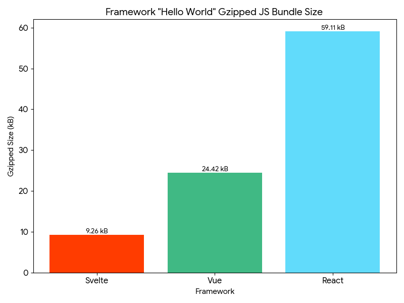

# Hello World Size Comparison: React vs Svelte vs Vue

## 📋 Prerequisites

- Bun 1.2.15

```sh
make install
```

## 📊 Results

`make build`

```js
React
vite v7.1.1 building for production...
✓ 32 modules transformed.
dist/index.html                   0.46 kB │ gzip:  0.30 kB
dist/assets/react-CHdo91hT.svg    4.13 kB │ gzip:  2.05 kB
dist/assets/index-BGJA1hV4.css    1.36 kB │ gzip:  0.69 kB
dist/assets/index-Cj3dOwPa.js   187.85 kB │ gzip: 59.11 kB
✓ built in 308ms
```

```js
Svelte
vite v7.1.1 building for production...
✓ 106 modules transformed.
dist/index.html                  0.46 kB │ gzip: 0.30 kB
dist/assets/index-opAbV4tk.css   1.22 kB │ gzip: 0.61 kB
dist/assets/index-DAH51dCu.js   21.64 kB │ gzip: 9.26 kB
✓ built in 174ms
```

```js
Vue
vite v7.1.1 building for production...
✓ 15 modules transformed.
dist/index.html                  0.46 kB │ gzip:  0.29 kB
dist/assets/index-BgDeyeb_.css   1.22 kB │ gzip:  0.62 kB
dist/assets/index-DLQdU_tn.js   60.55 kB │ gzip: 24.42 kB
✓ built in 232ms
```

### Comparison Graph

Lower is better


